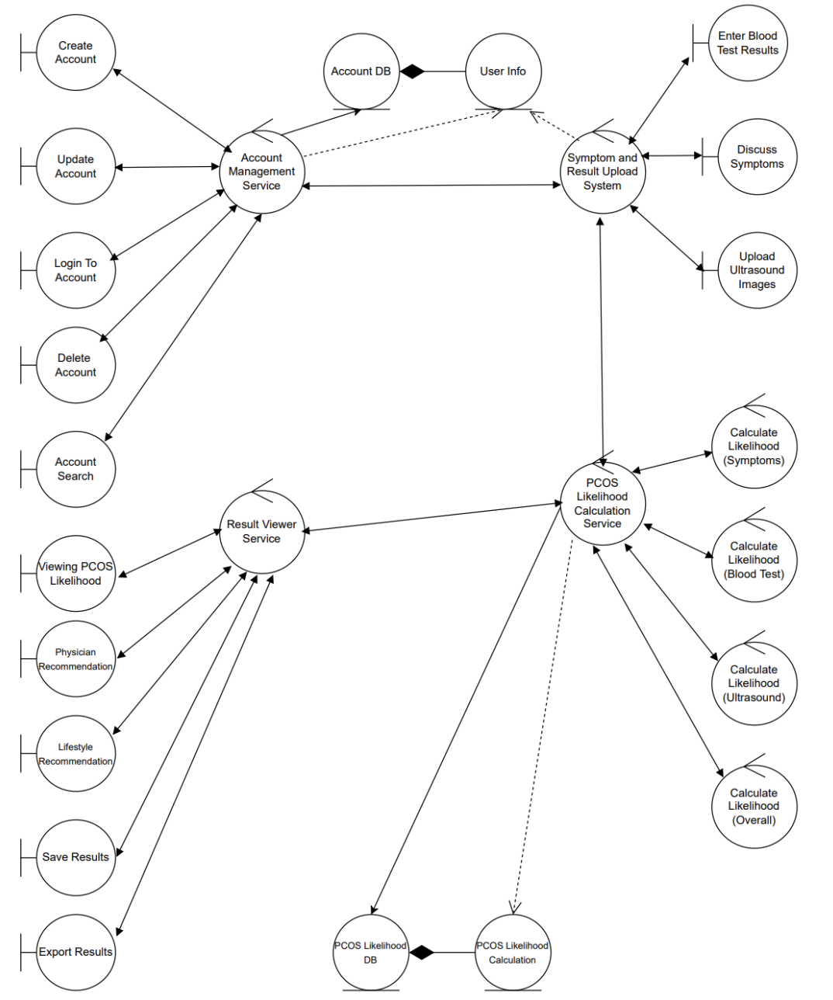
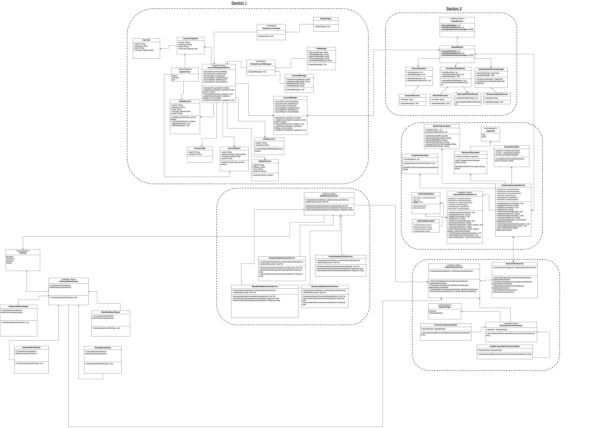
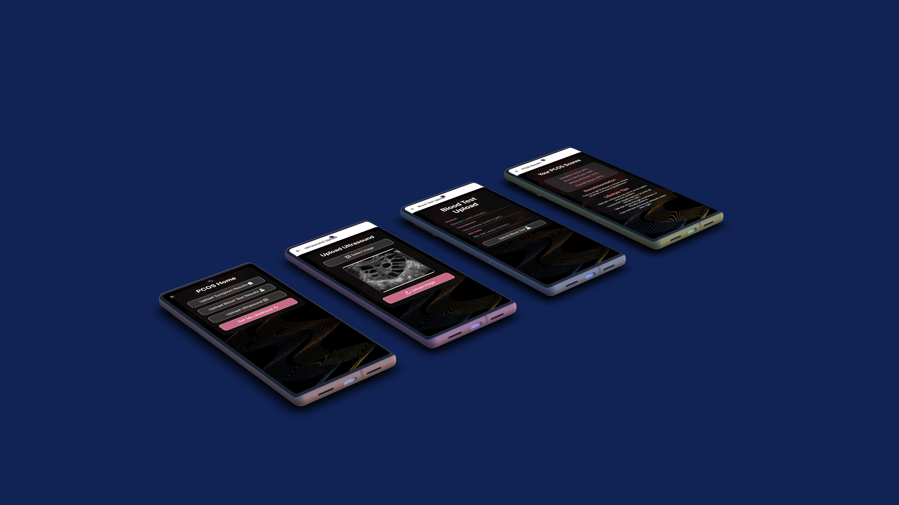
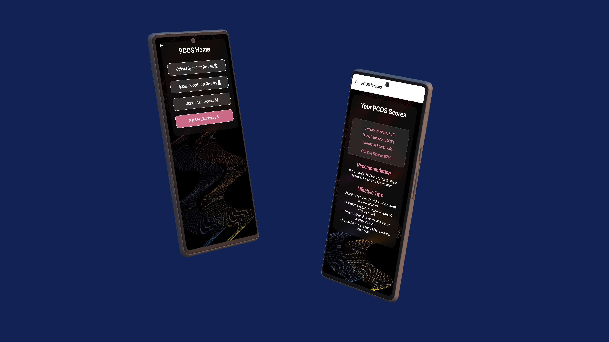

# PolyCare

_Revolutionizing PCOS Care: Smart Tech. Real Data. Clear Answers for PCOS_

PolyCare is an innovative Android-based health application designed to provide an early indication of Polycystic Ovary Syndrome (PCOS) by combining multiple data inputs. The system aggregates insights from three independent experts—a symptom chat agent powered by a large language model (LLM), a blood test analyzer using a research-based algorithm, and an ultrasound image classifier leveraging machine learning—to output a PCOS likelihood score. In addition, PolyCare offers clear recommendations for consulting a physician along with lifestyle tips to help manage symptoms.

---

## Table of Contents

- [PolyCare](#polycare)
  - [Table of Contents](#table-of-contents)
  - [Quick Start](#quick-start)
  - [Prerequisites](#prerequisites)
  - [Installation Instructions](#installation-instructions)
    - [Backend Setup](#backend-setup)
    - [Mobile App (PCOS-App)](#mobile-app-pcos-app)
  - [Usage](#usage)
  - [Features](#features)
  - [Architecture / Technical Overview](#architecture--technical-overview)
    - [Key Architectural Components](#key-architectural-components)
      - [Figures](#figures)
        - [Figure 1: Analysis Class Diagram\*](#figure-1-analysis-class-diagram)
        - [Figure 2: Architectural Diagram](#figure-2-architectural-diagram)
        - [Figure 3: Detailed Class Diagram](#figure-3-detailed-class-diagram)
  - [Screenshots](#screenshots)
  - [Documentation](#documentation)
  - [Authors and Acknowledgments](#authors-and-acknowledgments)
  - [Demo](#demo)

---

## Quick Start

1. **Clone the Repository:**
   ```bash
   git clone https://github.com/MahamSid/3A04.git
   cd 3A04
   git checkout SDK
   ```
2. **Backend Setup:**

   - Navigate to the backend folder and install dependencies using the provided requirements.txt:

   ```bash
   pip install -r backend/requirements.txt
   ```

   - Start the backend service:

   ```bash
   python3 backend/api.py
   ```

3. **Mobile App Setup (PCOS-App):**

   - Navigate to the `pcos-app` directory and install dependencies:

   ```bash
   cd pcos-app
   npm install
   ```

   - Start the Expo development server:

   ```bash
   npx expo start --port=5000
   ```

---

## Prerequisites

- **OS & Environment:** Android device/emulator with API level supporting Android 12 (S) or higher.
- **Backend:** Python 3.x with TensorFlow, Keras, NumPy (<2.0 compatibility), and openpyxl (installed via requirements.txt).
- **Mobile App:** Node.js and Expo CLI.
- **Internet Connection:** Required for API requests (e.g., LLM integration via OpenAI) and to pull data during account verification.

---

## Installation Instructions

### Backend Setup

1. Ensure Python 3.x is installed.
2. Install required Python libraries by running the following in the repository root:
   ```bash
   pip install -r backend/requirements.txt
   ```
3. Run the backend server:
   ```bash
   python3 backend/api.py
   ```
4. The backend handles ultrasound analysis, account management, results calculation, and result uploading.

### Mobile App (PCOS-App)

1. Navigate to the `pcos-app` folder:
   ```bash
   cd pcos-app
   ```
2. Install dependencies:
   ```bash
   npm install
   ```
3. Launch the app:
   ```bash
   npx expo  start --port=5000
   ```
4. Use the on-screen options to run on an Android emulator, iOS simulator, or Expo Go.

---

## Usage

1. **Account Management:**

   - Create, update, or delete accounts.
   - Login using verified credentials (health card number, MINC, or ONE ID).

2. **Input Data:**

   - **Symptom Chat:** Answer a guided set of questions about PCOS symptoms.
   - **Blood Test Data:** Enter values for key biomarkers such as glucose, testosterone, and bile salts.
   - **Ultrasound Upload:** Upload pelvic ultrasound images for analysis.

3. **PCOS Likelihood Calculation:**

   - Each input (symptoms, blood tests, and ultrasound) is analyzed independently.
   - A weighted average combines the individual likelihood scores to provide an overall PCOS risk percentage.

4. **Results and Recommendations:**
   - View detailed likelihood scores (individual and combined).
   - Receive recommendations to consult a physician if the risk is high.
   - Get lifestyle tips and suggestions for managing PCOS symptoms.

---

## Features

- **Multi-Agent Analysis:** Integrates text, numerical, and image data using three distinct agents.
- **Blackboard Architecture:** All partial results are stored in a central data store, which is then aggregated by the controller.
- **User-Friendly Interface:** Designed to be intuitive for women with varying levels of technological and medical expertise.
- **Secure and Transparent:** Each likelihood component is displayed individually for full transparency.
- **Innovative Recommendations:** Provides both medical guidance and lifestyle tips based on the calculated risk.

---

## Architecture / Technical Overview

PolyCare’s internal structure follows a **blackboard architectural pattern**, where different “knowledge source” agents work independently and post their partial solutions to a central repository (the blackboard). A controller module then combines these solutions to output a final, overall PCOS likelihood.

### Key Architectural Components

- **Account Management Service:** Manages user registration, login, updates, and deletions.
- **Symptom & Result Upload System:** Facilitates input from users – via chat for symptoms, forms for blood test data, and image upload for ultrasound scans.
- **PCOS Likelihood Calculation Service:** Receives data from the three independent agents:
  - **Symptom Chat Agent (LLM-based)**
  - **Blood Test Analyzer**
  - **Ultrasound Image Analyzer (ML-based)**
- **Result Viewer Service:** Aggregates and displays the results to the user, including recommendations and lifestyle tips.

#### Figures

##### Figure 1: Analysis Class Diagram\*



##### Figure 2: Architectural Diagram


##### Figure 3: Detailed Class Diagram



---

## Screenshots





> Device Mockup created from <a href="https://deviceframes.com/templates/google-pixel-6">Google Pixel 6 mockups</a>

---

## Documentation

The following deliverables provide comprehensive insights into PolyCare’s design and functionality:

- [Deliverable 1 (D1)](Deliverables/3A04_D1.pdf)
- [Deliverable 2 (D2)](Deliverables/3A04_D2.pdf)
- [Deliverable 3 (D3)](Deliverables/3A04_D3.pdf)

---

## Authors and Acknowledgments

PolyCare is a group effort by:

- [**Maham Siddiqui**](https://github.com/MahamSid)
- [**Jackson Beach**](https://github.com/JDBeach1503)
- [**Amal Hamid**](https://github.com/amalhamid)
- [**Zayed Umer**](https://github.com/zayedu)
- [**Saad Salman**](https://github.com/mSaadSalman)

---

## Demo

<p align="center">
  <a href="https://youtube.com/shorts/Q6II9GIoyKA?feature=share">
    
  </a>
</p>
